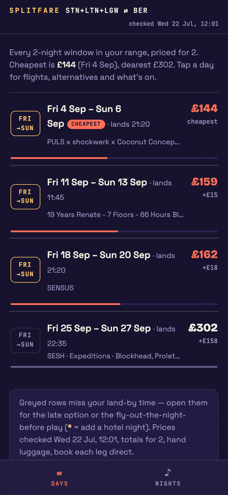
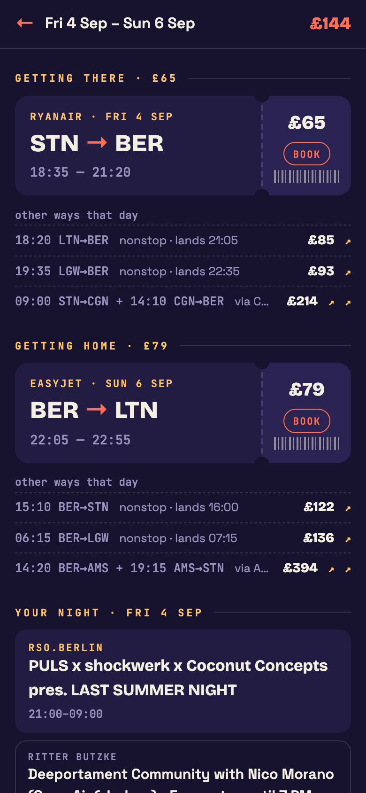
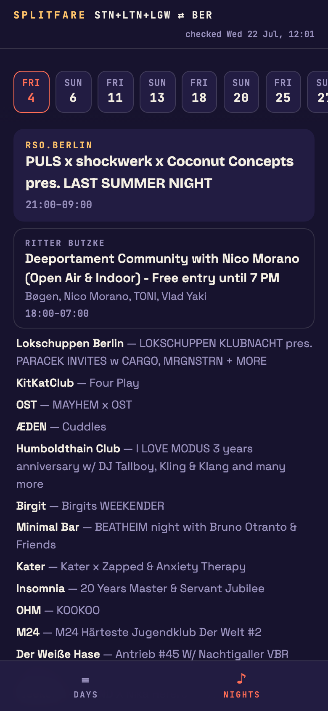

# splitfare 🎟️

**A flight-hacker's scanner for short trips: split tickets, trip-shape search,
and it knows what's on when you land.**

Booking sites answer *"how much are flights on these dates?"* splitfare
answers the question you actually have:

> *"Find me any weekend next month — out Friday or Saturday, landing before
> 2pm, home Sunday night — and tell me who's playing while I'm there."*

It prices the direct fares **and** every viable split-ticket combination
(separate cheap tickets glued together through hub airports — routings no
booking site will show you), sweeps whole months by *trip shape*, and pairs
every candidate window with the destination's event calendar.

<p align="center">
  
  
  
</p>

*Demo above: London → Berlin weekends in September for 2 people — every
Fri→Sun window priced, with Berlin's club calendar (Resident Advisor) per
night.*

## What it does

- **Split-ticket routing** — direct fares plus self-transfer combos through
  your chosen hub airports (same airport, enforced minimum connection, home
  the same day), ranked by total price for your whole party.
- **Trip-shape search** — sweep a month for the cheapest N-night window with
  human constraints: *out on these weekdays, land by this time, home by that
  time*.
- **Overnight positioning** — when landing early is impossible same-day, it
  prices flying to the hub the evening before and catching the morning flight.
- **Events fusion** — every candidate night shows who's playing, via pluggable
  providers (Resident Advisor worldwide, Ticketmaster, Skiddle, Ibiza
  Spotlight — or write your own in ~30 lines).
- **A phone dashboard** — `publish` renders a static site: browse every
  window by day, tap into flights, alternatives and lineups. Host it anywhere.
- **AI-agent native** — an MCP server exposes the whole thing to any
  MCP-capable assistant (Claude, etc.), plus an `ask` command for plain
  English from the terminal.

## Quickstart

```bash
git clone https://github.com/teatimedev/splitfare && cd splitfare
python3 -m venv .venv && .venv/bin/pip install -e ".[mcp]"
.venv/bin/splitfare init     # your airports, hubs, party size, events provider
```

Then:

```bash
# price one out/back pair — direct + split combos + what's on
.venv/bin/splitfare window 2026-09-04 2026-09-06 --events

# sweep a month: cheapest 2-night windows, Friday departures, land by 2pm
.venv/bin/splitfare scan --month 2026-09 --nights 2 --out-dow fri --arrive-by 14:00

# render the phone dashboard (static site in ./site — host anywhere)
.venv/bin/splitfare publish --month 2026-09 --nights 2

# plain English (drives the tool via the `claude` CLI if you have Claude Code)
.venv/bin/splitfare ask "cheapest weekend next month for 2, landing before 2pm?"
```

The first scan of a month is slow (~1.5 s per route-date, politely
rate-limited). Results cache for 6 h; after that everything is instant.

### Picking your hubs

Hubs are what make split ticketing work: airports with **cheap budget-airline
service from both your home and your destination**. Think Ryanair / easyJet /
Wizz bases — Stansted, Luton, Barcelona, Bergamo, Vienna, Warsaw… 5–10 is the
sweet spot; every hub adds ~4 lookups per date, so more hubs = more combos
found but slower scans. The `init` wizard walks you through it.

## Using it with your AI agent (MCP)

splitfare ships an MCP server, so any MCP-capable assistant can hunt flights
for you:

```bash
claude mcp add splitfare -- /path/to/splitfare/.venv/bin/splitfare-mcp
```

Three read-only tools: `splitfare_find_flights` (one date pair, full detail),
`splitfare_scan_month` (cheapest windows across a month), `splitfare_whats_on`
(event calendar). Your agent gets structured JSON — routings, per-leg booking
links, connection gaps, lineups — and can reason about trade-offs
("£15 more but you'd land 6 hours earlier and Four Tet is playing").

Three things to know:

1. **Run `splitfare init` first** — the server reads the `config.json` next to
   the code (or at `$SPLITFARE_HOME`). Without it, tools return a setup hint.
2. Uncached calls take seconds-to-minutes; `scan_month` with `deep=0` on a
   cold cache can exceed some clients' tool timeouts — start with specific
   dates or `deep=4`.
3. Prices are totals for the configured party, in your configured currency.

## Configuration

`splitfare init` writes `config.json`:

| key | meaning |
|---|---|
| `origins` / `destination` | IATA code lists (several codes = searched together, e.g. all London airports) |
| `hubs` | self-transfer candidates between them |
| `adults` | party size — **all prices are totals for the party** |
| `currency` | ISO code; used for fetching, display, and booking links |
| `min_connect_minutes` | self-transfer buffer (default 120; separate tickets — bigger is safer) |
| `flight_sources` | `["google"]` or `["google", "ryanair"]` (Ryanair's public fare API as fallback) |
| `events.provider` | see table below |

`SPLITFARE_HOME` relocates config/cache/site for pip installs.

### Events providers

| provider | coverage | key needed | notes |
|---|---|---|---|
| `resident-advisor` | clubbing, worldwide | no | `area_id`: ibiza 25 · london 13 · berlin 34 · barcelona 20 (others: ra.co → your city → id in the network tab) |
| `ticketmaster` | concerts/festivals, worldwide | free, instant ([signup](https://developer.ticketmaster.com)) | `$TICKETMASTER_API_KEY`; set `city` in config |
| `skiddle` | UK clubbing & gigs | free ([apply](https://www.skiddle.com/api/join.php)) | `$SKIDDLE_API_KEY`; optional lat/long/radius |
| `ibiza-spotlight` | Ibiza only | no | includes door prices |
| `none` | — | — | flights only |

Adding one is a single function in [providers.py](providers.py).

### Flight sources

Primary data comes from **Google Flights** via
[fast-flights](https://github.com/AWeirdDev/flights) — the only free source
that aggregates all the budget carriers. **Ryanair's public fare-finder API**
(no key) is available as an automatic fallback. For the curious: Amadeus
retired its self-service API in 2026, Kiwi's Tequila closed to new signups,
and Duffel doesn't carry Ryanair/Wizz — scraping the aggregator remains the
pragmatic play, which is also why this is a *run-it-yourself* tool and not a
website.

## How it works, honestly

- **The Google source can break whenever Google changes things.** Treat prices
  as estimates and book each leg directly with the airline — every result
  links to a matching search.
- **Split tickets carry real risk.** Separate bookings mean no
  missed-connection protection. The tool enforces a minimum gap and shows the
  gap on every result, but the risk is yours. Prefer long gaps.
- Be polite: requests are rate-limited and cached. Don't hammer it.

## Development

```bash
.venv/bin/pip install -e ".[dev]"
.venv/bin/pytest tests/ -q
```

PRs welcome — events providers for your scene, flight sources, and routing
improvements especially.

## License

MIT.
